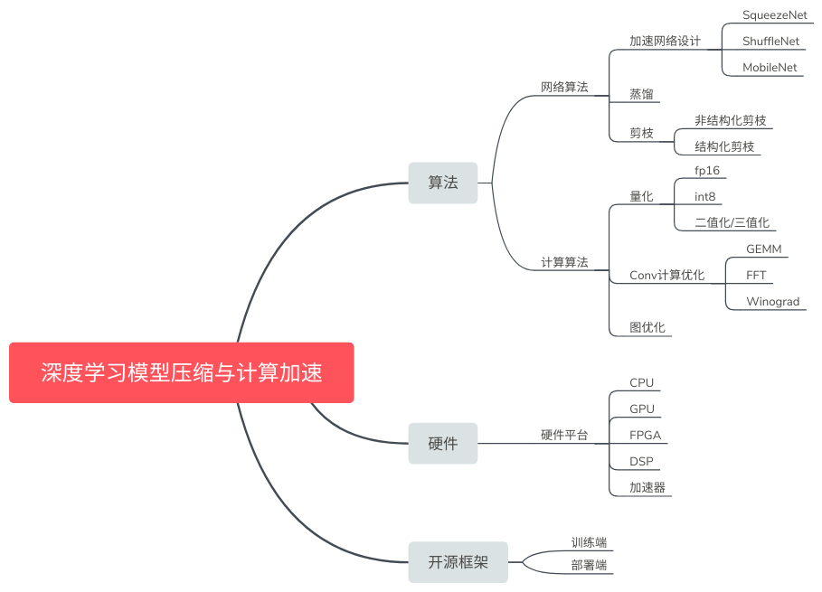

# 深度学习模型压缩与计算加速知识整理

整理一下深度学习模型压缩与计算加速相关的知识，包含三大板块：
* 算法：网络压缩算法（剪枝、蒸馏等）和计算加速算法（量化、Winograd等）
* 硬件平台：各个硬件平台（CPU、GPU）及编程接口和运算库介绍
* 开源框架：各大开源框架介绍

知乎链接：[专栏：深度学习模型压缩与计算加速学习](https://zhuanlan.zhihu.com/c_1064124187198705664)  
github链接：[https://github.com/ZichenTian/DL_accelerate_review](https://github.com/ZichenTian/DL_accelerate_review)

